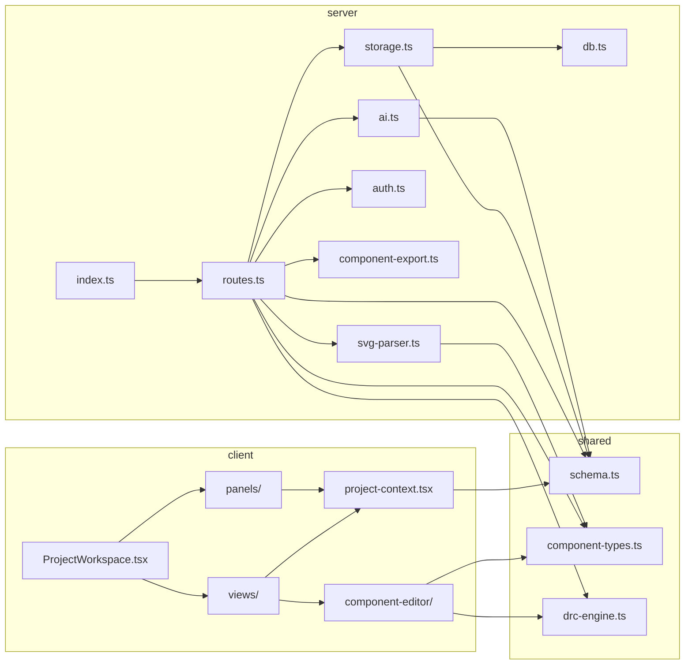

# Project Map — ProtoPulse

> Structural navigation index. Generated by /initref on 2026-02-18.
> This is a MAP — it tells you where to look, not what things do.

## Directory Structure
```
.
├── client/                      # React SPA
│   ├── src/
│   │   ├── components/
│   │   │   ├── layout/          # App shell: Sidebar, component tree, history
│   │   │   ├── panels/          # Right panels: ChatPanel, AssetManager
│   │   │   ├── views/           # Main content area: Architecture, ComponentEditor, etc.
│   │   │   └── ui/              # 40+ shadcn/ui primitives (don't touch unless asked)
│   │   ├── hooks/               # use-mobile, use-toast
│   │   ├── lib/                 # Core logic: ProjectProvider, queryClient, component-editor/
│   │   │   └── component-editor/ # Component editor subsystem: types, DRC, snap, constraints
│   │   └── pages/               # ProjectWorkspace (main), not-found
│   └── index.html
├── server/                      # Express 5 API
│   ├── __tests__/               # Single test file (api.test.ts)
│   ├── routes.ts                # ALL REST endpoints (50+)
│   ├── ai.ts                    # AI providers, prompts, streaming, actions
│   ├── storage.ts               # IStorage interface + DatabaseStorage
│   ├── auth.ts                  # Session auth, API key encryption
│   ├── component-export.ts      # FZPZ import/export logic
│   ├── svg-parser.ts            # SVG → Shape[] conversion
│   └── [db, cache, env, logger, metrics, static, vite].ts
├── shared/                      # Shared between client & server
│   ├── schema.ts                # 11 Drizzle tables + Zod schemas + types
│   ├── component-types.ts       # Component editor type system
│   └── drc-engine.ts            # Design Rule Check engine
├── docs/                        # Developer & user documentation
└── [config files]               # vite, drizzle, tsconfig, postcss, tailwind
```

## Module Inventory

### shared/
| File | Purpose | Key Exports |
|------|---------|-------------|
| schema.ts | Database tables, Zod schemas, TS types | `projects`, `architectureNodes`, `bomItems`, `validationIssues`, `chatMessages`, `users`, `sessions`, `componentParts`, `componentLibrary` + insert schemas + types |
| component-types.ts | Component editor type system | `Shape`, `Connector`, `Bus`, `Constraint`, `DRCRule`, `DRCViolation`, `PartState`, `PartMeta`, `PartViews`, `createDefaultPartState()` |
| drc-engine.ts | Design rule checking | `runDRC()`, `getDefaultDRCRules()` |

### server/
| File | Purpose | Key Exports |
|------|---------|-------------|
| index.ts | App bootstrap, Express setup, middleware | `log()` |
| routes.ts | All 50+ REST endpoints | `registerRoutes()` |
| ai.ts | AI prompt building, action parsing, SSE streaming | `processAIMessage()`, `streamAIMessage()`, `AIAction` |
| storage.ts | Data access layer with caching | `IStorage`, `DatabaseStorage`, `storage` |
| auth.ts | Session auth, API key AES encryption | `createUser`, `verifyPassword`, `createSession`, `validateSession`, `storeApiKey`, `getApiKey` |
| component-export.ts | FZPZ format import/export | `exportToFzpz()`, `importFromFzpz()` |
| svg-parser.ts | SVG string → Shape array | `parseSvgToShapes()` |
| db.ts | Drizzle + pg pool setup | `db`, `pool` |
| cache.ts | In-memory cache with prefix invalidation | `cache` |
| env.ts | Environment variable validation | `validateEnv()` |
| logger.ts | Winston logger instance | `logger` |
| metrics.ts | Request metrics collection | `recordRequest()`, `getMetrics()` |
| api-docs.ts | OpenAPI-style docs object | `apiDocs` |
| static.ts | Production static file serving | `serveStatic()` |
| vite.ts | Dev-mode Vite middleware setup | (default export) |

### client/src/lib/
| File | Purpose | Key Exports |
|------|---------|-------------|
| project-context.tsx | Monolithic project state provider | `ProjectProvider`, `useProject`, `PROJECT_ID`, `BlockNode`, `BomItem`, `ChatMessage`, `ViewMode` |
| queryClient.ts | React Query client + fetch helper | `queryClient`, `getQueryFn()` |
| context-selectors.ts | Selector hooks for ProjectProvider | selector functions |
| utils.ts | `cn()` classname merge | `cn()` |
| types.ts | Additional client types | (various) |
| clipboard.ts | Copy-to-clipboard utility | (various) |

### client/src/lib/component-editor/
| File | Purpose | Key Exports |
|------|---------|-------------|
| ComponentEditorProvider.tsx | Editor state context | `ComponentEditorProvider`, `useComponentEditor` |
| types.ts | Editor-specific types | tool types, canvas state |
| hooks.ts | Component library hooks | React Query hooks for parts/library |
| snap-engine.ts | Snap-to-grid/guide logic | snap functions |
| constraint-solver.ts | Geometric constraint solver | solver functions |
| constraint-inference.ts | Auto-detect constraints from shapes | inference functions |
| generators.ts | Shape generation from specs | generator functions |
| shape-templates.ts | Predefined shape factories | template functions |
| drc.ts | Re-exports shared DRC engine | `runDRC`, `getDefaultDRCRules` |
| validation.ts | Component validation logic | validation functions |

### client/src/components/views/
| File | Purpose |
|------|---------|
| ArchitectureView.tsx | @xyflow/react block diagram canvas |
| ComponentEditorView.tsx | SVG component editor with inspector panels |
| ProcurementView.tsx | BOM table with CRUD operations |
| ValidationView.tsx | Design validation issue list |
| OutputView.tsx | Export/output options |
| CustomNode.tsx | Custom React Flow node renderer |

### client/src/components/views/component-editor/
| File | Purpose |
|------|---------|
| ShapeCanvas.tsx | SVG rendering surface, shape manipulation |
| ComponentInspector.tsx | Property inspector panel |
| PinTable.tsx | Connector/pin editor table |
| LayerPanel.tsx | Shape layer ordering |
| DRCPanel.tsx | DRC rule config + violation display |
| SnapGuides.tsx | Visual snap alignment guides |
| RulerOverlay.tsx | Measurement ruler overlay |
| GeneratorModal.tsx | AI shape generation dialog |
| ValidationModal.tsx | Component validation dialog |
| ComponentLibraryBrowser.tsx | Browse/import shared components |
| HistoryPanel.tsx | Undo/redo history |

### client/src/components/panels/
| File | Purpose |
|------|---------|
| ChatPanel.tsx | AI chat UI, settings, streaming, action parsing |
| AssetManager.tsx | Project asset browser |
| chat/MessageBubble.tsx | Chat message rendering |
| chat/SettingsPanel.tsx | AI provider settings |
| chat/constants.ts | Chat config constants |

### client/src/components/layout/
| File | Purpose |
|------|---------|
| Sidebar.tsx | Navigation + component library panel |
| sidebar/ComponentTree.tsx | Hierarchical component browser |
| sidebar/HistoryList.tsx | Project history timeline |

## Dependency Graph



**Plaintext fallback:**
- `server/routes.ts` depends on: `storage`, `ai`, `auth`, `component-export`, `svg-parser`, `shared/schema`, `shared/component-types`, `shared/drc-engine`
- `server/storage.ts` depends on: `db`, `shared/schema`
- `server/ai.ts` depends on: `shared/schema` (indirectly via prompt building)
- `server/index.ts` depends on: `routes`, `static`, `env`, `logger`
- `server/svg-parser.ts` depends on: `shared/component-types`
- `client/lib/project-context.tsx` depends on: `shared/schema` (types)
- `client/lib/component-editor/` depends on: `shared/component-types`, `shared/drc-engine`
- `client/views/` depends on: `project-context`, `component-editor/`
- `client/panels/` depends on: `project-context`
- `client/pages/ProjectWorkspace.tsx` depends on: `views/`, `panels/`, `layout/`

## Test Coverage Map
| Directory | Source Files | Test Files | Coverage |
|-----------|-------------|-----------|----------|
| server/ | 15 | 1 | 7% |
| client/src/ | 98 | 0 | 0% |
| shared/ | 3 | 0 | 0% |

Single test file: `server/__tests__/api.test.ts`. No client-side tests exist. Exercise extreme caution when refactoring — no safety net.
