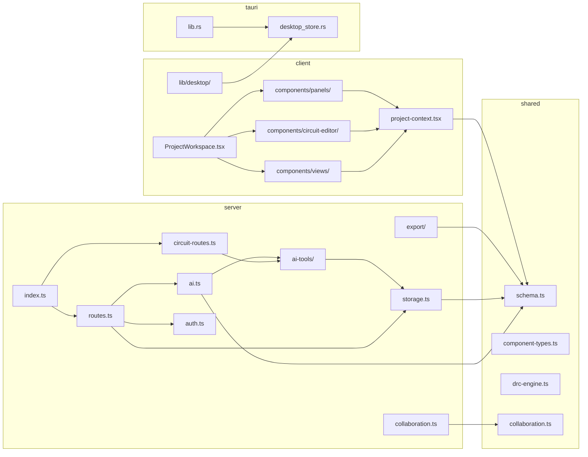

# Project Map — ProtoPulse

> Structural navigation index. Full rescan by /initref on 2026-05-26.
> This is a MAP — it tells you where to look, not what things do. ~1377 source files; only significant subsystems listed.

## Directory Structure

```
.
├── client/src/                       # React 19 SPA (1094 src files, 610 test files)
│   ├── components/
│   │   ├── circuit-editor/  (181)    # Schematic/Breadboard/PCB canvases + editors
│   │   ├── views/           (165)    # 27 workspace views (Architecture, Dashboard, Procurement, ...)
│   │   ├── ui/              (110)    # shadcn/ui primitives (don't touch unless asked)
│   │   ├── panels/          (86)     # Right-rail panels: ChatPanel, ExportPanel, inspectors
│   │   ├── simulation/      (16)     # Arduino/firmware simulation UI
│   │   ├── layout/          (13)     # App shell: sidebar, header
│   │   ├── arduino/         (12)     # Arduino workbench panels
│   │   └── collaboration/  (2)       # Real-time presence/conflict UI
│   ├── lib/                          # Core client logic
│   │   ├── simulation/      (93)     # AVR/firmware sim engine
│   │   ├── arduino/         (90)     # Arduino toolchain client
│   │   ├── circuit-editor/  (51)     # Canvas state, geometry
│   │   ├── pcb/             (45)     # PCB layout engine, copper pour, autoroute
│   │   ├── parts/           (22)     # Parts catalog client
│   │   ├── circuit-dsl/     (19)     # Circuit description language
│   │   ├── desktop/                  # Tauri store adapter + storage migration
│   │   ├── component-editor/ (16)    # Component editor subsystem
│   │   └── ai-prediction-engine/(15) # AI-assisted prediction
│   ├── hooks/                        # Shared React hooks (useVaultQuickFetch, ...)
│   ├── pages/                        # ProjectWorkspace (main 3-panel layout)
│   ├── types/  ├── test-utils/  └── vendor/
├── server/                           # Express 5 API (214 src, 131 test files)
│   ├── export/             (55)      # KiCad/Eagle/SPICE/Gerber/drill/P&P/netlist generators
│   ├── routes/             (41)      # Domain REST routers (barrel: routes.ts)
│   ├── ai-tools/           (35)      # ~117 AI tool definitions (barrel: ai-tools.ts)
│   ├── lib/                (26)      # Server utilities
│   ├── storage/            (20)      # Storage layer modules
│   ├── circuit-routes/     (15)      # Circuit schematic routers (barrel: circuit-routes.ts)
│   ├── circuit-ai/         (8)       # Circuit AI helpers
│   ├── firmware-runtime/   (7)       # Firmware simulation runtime
│   ├── ai.ts  ai-openai-agents.ts  collaboration.ts  auth.ts  storage.ts  db.ts  cache.ts
│   └── index.ts                      # Bootstrap: Express + Vite middleware + SPA serve
├── shared/                           # Shared client+server (69 src, 35 test files)
│   ├── schema.ts                     # 51 Drizzle tables + Zod schemas
│   ├── component-types.ts  circuit-types.ts  circuit-schemas.ts
│   ├── drc-engine.ts  drc-templates.ts       # Design rule checking
│   ├── collaboration.ts              # LWW Lamport-clock CRDT (shared logic)
│   ├── exact-part-*.ts               # Exact-part resolver/verification/policy
│   ├── {bom,arch,netlist}-diff.ts    # Diff engines
│   └── api-types.generated.ts        # Generated API types (npm run types:generate)
├── src-tauri/                        # Tauri v2 desktop shell (Rust, 7 files)
│   └── src/{lib,main,desktop_store,path_validation,native_project_open}.rs
├── migrations/                       # Drizzle SQL migrations + journal
├── e2e/                              # Playwright specs (19)
├── scripts/  docs/  shared knowledge/ + vault dirs (data, inbox, ops, knowledge)
```

## Module Inventory

### shared/ (key files)
| File | Purpose | Key Exports |
|------|---------|-------------|
| schema.ts | 51 Drizzle tables, Zod schemas, types | `projects`, `architectureNodes`, `architectureEdges`, `bomItems`, `chatMessages`, `users`, `sessions`, `componentParts`, ... + insert schemas |
| component-types.ts | Component editor type system | `Shape`, `Connector`, `Bus`, `Constraint`, `DRCRule`, `PartState`, `createDefaultPartState()` |
| drc-engine.ts | Design rule checking (client+server) | `runDRC()`, `getDefaultDRCRules()` |
| collaboration.ts | CRDT conflict detection + LWW | `lwwWins()`, `detectConflict()`, op/timestamp types |
| circuit-types.ts / circuit-schemas.ts | Circuit graph types + Zod | netlist/schematic shapes |
| exact-part-resolver.ts | Resolve generic → exact MPN | resolver functions |

### server/ (key files)
| File | Purpose | Key Exports |
|------|---------|-------------|
| index.ts | App bootstrap, Express, Vite middleware | bootstrap |
| routes.ts | Barrel → 41 domain routers | `registerRoutes()` |
| circuit-routes.ts | Barrel → 15 circuit routers | circuit router registration |
| ai.ts | AI prompts, ~117 tools, SSE streaming, Gemini+OpenAI routing | `processAIMessage()`, `streamAIMessage()` |
| ai-openai-agents.ts | OpenAI agents provider | OpenAI agent runners |
| ai-tools.ts | Barrel → 22 tool modules | tool registry |
| storage.ts | `IStorage` + `DatabaseStorage` + LRU cache | `IStorage`, `DatabaseStorage`, `storage` |
| auth.ts | Session auth + AES-256-GCM API-key encryption | `createSession`, `validateSession`, `storeApiKey`, `getApiKey` |
| collaboration.ts | Real-time WS collab, server Lamport clock, conflict broadcast | `mergeAndBroadcastOps()` |
| routes/settings.ts | API-key + chat settings (providers: gemini/openai/jlcpcb/pcbway/oshpark/google_workspace) | settings router |
| db.ts / cache.ts / env.ts / logger.ts / metrics.ts | Infra | `db`, `cache`, `validateEnv()`, `logger` |

### server/ai-tools/ (guard pattern)
`circuit/` submodules (`shared.ts`, `pcb.ts`, `pcb-autoroute.ts`, `schematic.ts`, `pcb-advanced.ts`) — `guardCircuitInProject()` defined in `circuit/shared.ts`, invoked by every circuit mutation executor (ownership enforcement).

### client/src/lib/ (key files)
| File | Purpose | Key Exports |
|------|---------|-------------|
| project-context.tsx | Monolithic project state provider (40+ values) | `ProjectProvider`, `useProject` |
| queryClient.ts | React Query client + fetch helper | `queryClient`, `getQueryFn()` |
| desktop/desktop-store-adapter.ts | Tauri-vs-web store branching | `getUserSettingStore`, `getKanbanStateStore`, `getDesignVariablesStore` |
| desktop/storage-migration-runner.ts | localStorage→plugin-store migration | `USER_SETTINGS_MIGRATION_ALLOWLIST`, `USER_SETTINGS_HARD_EXCLUDE` |
| pcb/ | PCB layout engine, copper pour, autoroute | layout/pour/route fns |
| board-viewer-3d.ts | Three.js 3D board viewer singleton | `BoardViewer3D` |

### src-tauri/src/ (Rust desktop)
| File | Purpose |
|------|---------|
| lib.rs | Tauri entry: plugin registration (store/fs/shell/dialog/deep-link/single-instance/window-state) + typed command surface |
| desktop_store.rs | 6 typed plugin-store commands (read/write × user_setting/kanban_state/project_design_variables); JSON-stringified `String` params (specta-safe) |
| path_validation.rs | Scope + deny-list path validation; `open_no_follow_read/write` (O_NOFOLLOW) |
| native_project_open.rs | Deep-link / file-association project-open queue |

## Dependency Graph


```mermaid
graph LR
  subgraph shared
    schema[schema.ts]
    ctypes[component-types.ts]
    drc[drc-engine.ts]
    collab_s[collaboration.ts]
  end
  subgraph server
    routes[routes.ts]
    croutes[circuit-routes.ts]
    ai[ai.ts]
    aitools[ai-tools/]
    storage[storage.ts]
    auth[auth.ts]
    collab[collaboration.ts]
    exp[export/]
    idx[index.ts]
  end
  subgraph client
    projctx[project-context.tsx]
    workspace[ProjectWorkspace.tsx]
    views[components/views/]
    ceditor[components/circuit-editor/]
    panels[components/panels/]
    desktop[lib/desktop/]
  end
  subgraph tauri
    librs[lib.rs]
    dstore[desktop_store.rs]
  end

  idx --> routes
  idx --> croutes
  routes --> storage
  routes --> ai
  routes --> auth
  croutes --> aitools
  ai --> aitools
  ai --> schema
  aitools --> storage
  storage --> schema
  exp --> schema
  collab --> collab_s
  projctx --> schema
  views --> projctx
  ceditor --> projctx
  panels --> projctx
  workspace --> views
  workspace --> panels
  workspace --> ceditor
  desktop --> dstore
  librs --> dstore
```

**Plaintext fallback:**
- `server/index.ts` → `routes.ts`, `circuit-routes.ts`, Vite middleware
- `server/routes.ts` → `storage`, `ai`, `auth` (+ 41 domain routers)
- `server/ai.ts` → `ai-tools/`, `shared/schema`
- `server/ai-tools/` → `storage` (guarded by `guardCircuitInProject`)
- `server/storage.ts` → `db`, `shared/schema`
- `server/export/` → `shared/schema`, circuit types
- `server/collaboration.ts` → `shared/collaboration.ts`
- `client/lib/project-context.tsx` → `shared/schema` (types)
- `client/components/{views,panels,circuit-editor}/` → `project-context`
- `client/pages/ProjectWorkspace.tsx` → `views/`, `panels/`, `circuit-editor/`
- `client/lib/desktop/` → `src-tauri` typed commands (Tauri only)
- `src-tauri/src/lib.rs` → `desktop_store.rs`, `path_validation.rs`, `native_project_open.rs`

## Test Coverage Map

| Area | Source Files | Test Files | Rough Coverage |
|------|-------------|-----------|----------------|
| client/src/ | 1094 | 610 | ~56% (file ratio) |
| server/ | 214 | 131 | ~61% |
| shared/ | 69 | 35 | ~51% |
| e2e (Playwright) | — | 19 | cross-cutting flows |

Strong unit coverage across all three layers (a major change from the original single-test-file state). Client tests run on **happy-dom**; server/shared on **node**. The shared `client/src/test-setup.ts` is deliberately minimal — per-file tests install their own `localStorage`/`fetch` stubs at module level. A repo hook forces all test runs to the background.

## Notable Conventions for Navigators

- **Barrels everywhere**: `routes.ts`, `circuit-routes.ts`, `ai-tools.ts` are barrels — the real handlers live in the same-named directories. A refactor split `ai-tools/circuit.ts` into `ai-tools/circuit/*.ts` (2026-04-18).
- **AI tool ownership**: every circuit mutation calls `guardCircuitInProject()` (`server/ai-tools/circuit/shared.ts`).
- **Migration drift gate**: `server/__tests__/migration-drift.test.ts` asserts `shared/schema.ts` table count (51) matches migrations — bump it deliberately when adding tables.
- **Tauri specta**: typed commands use `String` (JSON-stringified) params, never `serde_json::Value`.
