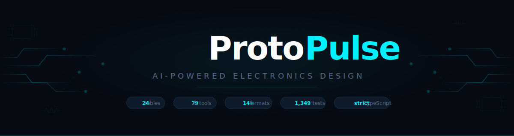
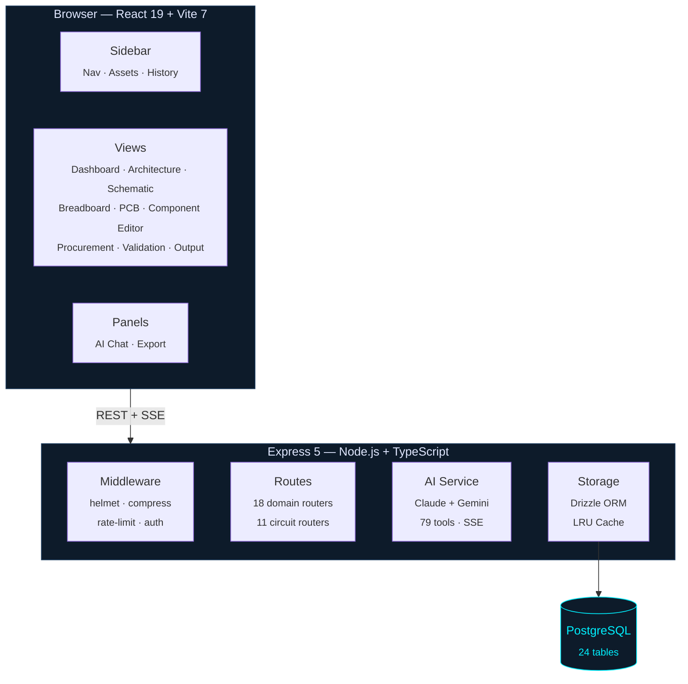

<div align="center">

<br>



<br>
<br>

**The open-source EDA platform that designs circuits with you.**
<br>
*Schematic capture · SPICE simulation · 14+ export formats · 79 AI tools — all in your browser.*

<br>

[](https://www.typescriptlang.org/)
[](https://react.dev/)
[](https://vitest.dev/)
[](LICENSE)

[**Features**](#features) · [**Why ProtoPulse**](#why-protopulse) · [**Quick Start**](#quick-start) · [**AI Engine**](#ai-engine) · [**Architecture**](#architecture) · [**Roadmap**](#roadmap) · [**Docs**](#documentation)

</div>

<br>

---

<br>

## The Pitch

Most EDA tools were designed in the 1990s and it shows — bloated desktop installs, steep learning curves, zero intelligence. ProtoPulse is what happens when you rebuild electronics design from scratch for the browser era, then hand the AI real tools instead of just a chat box.

**Describe a circuit in plain English. Watch it appear on screen.** The AI doesn't suggest what components you might need — it places them, wires them, populates your BOM, runs design rule checks, and exports manufacturing files. All while you're still typing the next sentence.

> **Think Fritzing meets KiCad, rebuilt for the browser, with an AI engineer sitting next to you.**

<br>

<!--
  ┌─────────────────────────────────────────────────────────────┐
  │  TODO: Add product screenshot or GIF here once the app      │
  │  is running with a populated project. Capture the           │
  │  schematic editor with a non-trivial circuit, dark theme,   │
  │  neon cyan accents visible. Use shot-scraper or manually.   │
  │                                                              │
  │               │
  └─────────────────────────────────────────────────────────────┘
-->

## Features

<table>
<tr>
<td width="50%" valign="top">

<h3>Schematic Capture</h3>

Full interactive circuit editor — place component **instances**, draw **nets** with Manhattan routing, add power symbols, no-connect markers, and net labels. **ERC** catches unconnected pins, shorted outputs, and conflicting drivers in real time. Hierarchical sheets for large designs.

</td>
<td width="50%" valign="top">

<h3>AI Design Assistant</h3>

An AI that **acts**, not just answers. Generate complete architectures from a sentence. Place components, wire connections, populate your BOM, run validation, export to KiCad — **79 tool actions** across 11 modules. Streams via SSE with **Claude** and **Gemini** support.

</td>
</tr>
<tr>
<td width="50%" valign="top">

<h3>Architecture Editor</h3>

Interactive block diagram canvas powered by React Flow. Drag components from a categorized library — MCU, Sensor, Power, Communication, Connector, Memory, Actuator — connect them with typed signal edges (SPI, I2C, UART, USB, Power, GPIO), and see your entire system at a glance.

</td>
<td width="50%" valign="top">

<h3>Multi-Format Export</h3>

**14+ output formats** covering the full manufacturing handoff: **KiCad** · **Eagle** · **SPICE** · **BOM CSV** · **Gerber** (copper, mask, silkscreen, paste) · **drill files** (Excellon) · **pick-and-place** · **netlist** · **design report** · **FMEA** · **firmware scaffold** · **PDF**.

</td>
</tr>
<tr>
<td width="50%" valign="top">

<h3>Breadboard & PCB Views</h3>

Breadboard visualization for prototyping layout. PCB layout view with layer management, trace routing, width presets, and ratsnest overlay. Translate your schematic to physical placement without leaving the browser.

</td>
<td width="50%" valign="top">

<h3>Design Validation</h3>

Automated **DRC** catches errors, warnings, and info-level issues across your design. **ERC** validates schematic connectivity. Manufacturer rule templates (JLCPCB, PCBWay, OSHPark). Each finding shows the affected component, a human-readable message, and a suggested fix.

</td>
</tr>
<tr>
<td width="50%" valign="top">

<h3>SPICE Simulation</h3>

Generate SPICE netlists. Run **AC/frequency analysis** with Bode plots — gain and phase across decades. Five filter topologies supported. SI suffix parsing for component values. Simulation results cached per-design.

</td>
<td width="50%" valign="top">

<h3>Bill of Materials</h3>

Full BOM management with pricing, suppliers, stock status, lead times. **BOM snapshot diffing** tracks changes between revisions. **Netlist comparison** (ECO) diffs two circuit versions. Component **lifecycle tracking** flags obsolescence. CSV export.

</td>
</tr>
<tr>
<td width="50%" valign="top">

<h3>Component Editor</h3>

Multi-view part editor: breadboard representation, schematic symbol, PCB footprint, metadata (manufacturer, MPN, package, datasheet), and pin table. Interactive SVG canvas with shape tools. Fork library components and customize.

</td>
<td width="50%" valign="top">

<h3>Dark-First Design</h3>

Crafted dark theme with **neon cyan** (`#00F0FF`) and purple accents, built for long design sessions. Engineering-grade typography: Rajdhani for display, JetBrains Mono for technical data, Inter for body text. Command palette (Ctrl+K) for fast navigation.

</td>
</tr>
</table>

<br>

## Why ProtoPulse

<table>
<tr>
<th align="left">Capability</th>
<th align="center">ProtoPulse</th>
<th align="center">KiCad</th>
<th align="center">Fritzing</th>
<th align="center">EasyEDA</th>
<th align="center">Altium</th>
</tr>
<tr><td><strong>Browser-based</strong></td><td align="center">Yes</td><td align="center">No</td><td align="center">No</td><td align="center">Yes</td><td align="center">No</td></tr>
<tr><td><strong>AI assistant with real tools</strong></td><td align="center"><strong>79 tools</strong></td><td align="center">No</td><td align="center">No</td><td align="center">Limited</td><td align="center">No</td></tr>
<tr><td><strong>Open source</strong></td><td align="center">MIT</td><td align="center">GPL</td><td align="center">GPL</td><td align="center">No</td><td align="center">No</td></tr>
<tr><td><strong>Architecture block diagrams</strong></td><td align="center">Yes</td><td align="center">No</td><td align="center">No</td><td align="center">No</td><td align="center">No</td></tr>
<tr><td><strong>Concept-to-export in one tool</strong></td><td align="center">Yes</td><td align="center">Partial</td><td align="center">No</td><td align="center">Partial</td><td align="center">Yes</td></tr>
<tr><td><strong>BOM snapshot diffing</strong></td><td align="center">Yes</td><td align="center">No</td><td align="center">No</td><td align="center">No</td><td align="center">Plugin</td></tr>
<tr><td><strong>Netlist ECO comparison</strong></td><td align="center">Yes</td><td align="center">Manual</td><td align="center">No</td><td align="center">No</td><td align="center">Yes</td></tr>
<tr><td><strong>14+ export formats</strong></td><td align="center">Yes</td><td align="center">Yes</td><td align="center">Limited</td><td align="center">Partial</td><td align="center">Yes</td></tr>
<tr><td><strong>SPICE simulation</strong></td><td align="center">Yes</td><td align="center">Plugin</td><td align="center">No</td><td align="center">Yes</td><td align="center">Plugin</td></tr>
<tr><td><strong>No installation</strong></td><td align="center">Yes</td><td align="center">No</td><td align="center">No</td><td align="center">Yes</td><td align="center">No</td></tr>
<tr><td><strong>Price</strong></td><td align="center"><strong>Free</strong></td><td align="center">Free</td><td align="center">$8/mo</td><td align="center">Freemium</td><td align="center">$350+/mo</td></tr>
</table>

<br>

## Quick Start

```bash
# Clone and install
git clone https://github.com/wtyler2505/ProtoPulse.git
cd ProtoPulse && npm install

# Push database schema (requires DATABASE_URL in .env)
npm run db:push

# Launch — open http://localhost:5000
npm run dev
```

Seed a demo project with sample data:

```bash
curl -X POST http://localhost:5000/api/seed
```

<details>
<summary><strong>Environment Variables</strong></summary>
<br>

| Variable | Description | Required |
|:---------|:------------|:--------:|
| `DATABASE_URL` | PostgreSQL connection string | Yes |
| `API_KEY_ENCRYPTION_KEY` | 32-byte hex for AES-256-GCM encryption | Production |
| `LOG_LEVEL` | `debug` · `info` · `warn` · `error` | No |
| `NODE_ENV` | `development` · `production` | No |

</details>

<details>
<summary><strong>All Scripts</strong></summary>
<br>

```bash
npm run dev             # Dev server with hot reload (port 5000)
npm run dev:client      # Vite dev server only
npm run build           # Production build (Vite + esbuild)
npm start               # Production server
npm run check           # TypeScript type check (must pass clean)
npm run db:push         # Sync Drizzle schema to PostgreSQL
npm test                # All tests (49 files, 1,349 tests)
npm run test:watch      # Vitest interactive watch mode
npm run test:coverage   # Tests with v8 coverage report
npx eslint .            # Lint (strict TypeScript rules)
npx prettier --write .  # Format
```

</details>

<br>

## AI Engine

The AI doesn't just chat — it has **79 tool actions** that directly manipulate your design:

<table>
<tr>
<th align="left">Module</th>
<th align="left">Actions</th>
</tr>
<tr><td><strong>Architecture</strong></td><td>Add/remove/update nodes and edges · generate complete architectures from text · auto-layout · manage hierarchical sheets · assign net names · set pin maps</td></tr>
<tr><td><strong>Circuit</strong></td><td>Create circuits · place/remove instances · draw/remove nets · place power symbols, no-connects, net labels · run ERC · place breadboard wires · draw PCB traces · auto-route</td></tr>
<tr><td><strong>BOM</strong></td><td>Add/remove/update items · export CSV · pricing lookup · suggest alternatives · optimize BOM · parametric search · add datasheets · compare components</td></tr>
<tr><td><strong>Validation</strong></td><td>Run DRC · add/clear issues · power budget analysis · voltage domain check · auto-fix · DFM check · thermal analysis · generate test plan</td></tr>
<tr><td><strong>Export</strong></td><td>KiCad · Eagle · SPICE · BOM CSV · Gerber · drill · pick-and-place · netlist (KiCad + CSV) · design report · Fritzing project</td></tr>
<tr><td><strong>Component</strong></td><td>Create/modify/delete parts · fork library components · validate</td></tr>
<tr><td><strong>Navigation</strong></td><td>Switch views · switch schematic sheets</td></tr>
<tr><td><strong>Project</strong></td><td>Rename · update description · save decisions · add annotations · undo/redo · analyze images</td></tr>
</table>

Every action is **typed**, **validated**, and **idempotent**. Destructive actions require explicit confirmation.

**Multi-model routing**: Claude handles complex reasoning; Gemini provides an alternative. Both stream over SSE.

<details>
<summary><strong>Example: AI builds a power supply</strong></summary>
<br>

> **You:** "Design a 3.3V regulated power supply from USB-C input with input protection and decoupling."

The AI will:
1. **Add architecture nodes** — USB-C connector, TVS diode, ferrite bead, LDO regulator, decoupling caps
2. **Wire them together** with typed signal edges (Power, Data)
3. **Populate the BOM** — specific part numbers, pricing, package types
4. **Run DRC** — verify power domain consistency, missing decoupling
5. **Generate** a SPICE netlist for simulation

All in a single streamed response. Every action logged and undoable.

</details>

<br>

## Architecture



<details>
<summary><strong>Tech Stack</strong></summary>
<br>

| Layer | Technology |
|:------|:-----------|
| **Frontend** | React 19 · TypeScript 5.6 · Vite 7 · Tailwind CSS v4 |
| **UI** | shadcn/ui (60+ components) · Radix UI · @xyflow/react |
| **State** | TanStack React Query (no Redux) |
| **Backend** | Node.js · Express 5 · TypeScript (tsx) |
| **Database** | PostgreSQL · Drizzle ORM · LRU cache |
| **AI** | Anthropic Claude SDK · Google Generative AI SDK |
| **Auth** | Session-based (X-Session-Id) · scrypt · AES-256-GCM |
| **Testing** | Vitest 4 · happy-dom · @testing-library/react · v8 coverage |
| **Routing** | Wouter (client) · Express barrel routers (server) |

</details>

<details>
<summary><strong>Database Schema — 24 tables</strong></summary>
<br>

| Table | Purpose |
|:------|:--------|
| `projects` | Top-level project records (soft delete) |
| `architecture_nodes` | Block diagram nodes (soft delete) |
| `architecture_edges` | Block diagram connections (soft delete) |
| `bom_items` | Bill of materials line items (soft delete) |
| `bom_snapshots` | Versioned BOM snapshots for diffing |
| `validation_issues` | DRC/ERC findings |
| `chat_messages` | AI conversation history with branches |
| `history_items` | Design change history |
| `users` | User accounts |
| `sessions` | Auth sessions with rotation |
| `api_keys` | Encrypted user API keys (AES-256-GCM) |
| `user_chat_settings` | Per-user AI chat configuration |
| `component_parts` | User-defined custom component parts |
| `component_library` | Shared component library entries |
| `circuit_designs` | Schematic designs (hierarchical sheets) |
| `hierarchical_ports` | Sheet port declarations |
| `circuit_instances` | Placed component instances |
| `circuit_nets` | Named electrical nets |
| `circuit_wires` | Wire segments |
| `simulation_results` | SPICE simulation output cache |
| `ai_actions` | Audit log of AI-executed actions |
| `design_preferences` | Per-project design rule preferences |
| `spice_models` | User SPICE model library |
| `component_lifecycle` | Component obsolescence tracking |

</details>

<details>
<summary><strong>Project Structure</strong></summary>
<br>

```
client/src/
  pages/                Route pages (ProjectWorkspace, AuthPage)
  components/
    views/              Architecture, Schematic, ComponentEditor, Procurement,
                        Validation, Output, BomDiff, Dashboard, WelcomeOverlay
    circuit-editor/     SchematicCanvas, BreadboardView, PCBLayoutView, ERCPanel,
                        NetClassPanel, HierarchicalSheetPanel, NetDrawingTool
    panels/             ChatPanel, ExportPanel, AssetManager
    layout/             Sidebar, WorkflowBreadcrumb, ProjectExplorer
    ui/                 60+ shadcn/ui primitives, CommandPalette
  lib/
    project-context     ProjectProvider — 40+ state values, React Query mutations
    circuit-editor/     Wire router, breadboard model, ERC engine
    simulation/         SPICE generator, circuit solver, frequency analysis
    component-editor/   Constraint solver, diff engine, snap engine

server/
  routes.ts             Barrel — 18 domain routers from server/routes/
  routes/               auth, projects, architecture, bom, validation, chat,
                        history, components, settings, admin, seed, batch,
                        bom-snapshots, chat-branches, design-preferences,
                        spice-models, component-lifecycle, project-io
  circuit-routes.ts     Barrel — 11 circuit routers from server/circuit-routes/
  circuit-routes/       designs, instances, nets, wires, netlist, exports,
                        simulations, hierarchy, imports, autoroute, expansion
  ai.ts                 AI integration — Claude + Gemini, streaming, 79 tools
  ai-tools/             11 modules: architecture, bom, circuit, component,
                        export, navigation, project, validation, registry, types
  storage.ts            IStorage interface + DatabaseStorage (LRU cache, 1,598 lines)
  export/               16 files — KiCad, Eagle, SPICE, BOM, Gerber, drill,
                        pick-and-place, netlist, design-report, FMEA, firmware,
                        PDF, DRC-gate, FZPZ handler, types

shared/
  schema.ts             24 Drizzle tables + Zod validators (504 lines)
  drc-engine.ts         Design rule checking engine (server + client)
  bom-diff.ts           BOM snapshot comparison engine
  netlist-diff.ts       Netlist comparison / ECO engine
  component-types.ts    Component editor type system
  drc-templates.ts      Manufacturer DRC rule templates
```

</details>

<br>

## Quality

<table>
<tr>
<td align="center"><strong>49</strong><br><sub>test files</sub></td>
<td align="center"><strong>1,349</strong><br><sub>tests passing</sub></td>
<td align="center"><strong>0</strong><br><sub>TypeScript errors</sub></td>
<td align="center"><strong>strict</strong><br><sub>mode enabled</sub></td>
<td align="center"><strong>24</strong><br><sub>database tables</sub></td>
<td align="center"><strong>50+</strong><br><sub>API endpoints</sub></td>
</tr>
</table>

- **Vitest 4** with workspace projects (server + client isolation)
- **happy-dom** for client-side component testing
- **@testing-library/react** for behavior-driven UI tests
- **v8 coverage** reporting
- **ESLint** strict TypeScript rules + **Prettier** formatting
- **Zod** validation on every API boundary

<br>

## Roadmap

```
Phase 2   ████████████████████  Complete    Component Editor (SVG, connectors, buses)
Phase 3   ████████████████████  Complete    Circuit schematic capture (instances, nets, ERC)
Phase 4   ████████████████████  Complete    Breadboard / PCB layout, Gerber & KiCad export
Phase 5   ████████████████████  Complete    Circuit simulation, SPICE, frequency analysis
Phase 0   ████████████░░░░░░░░  Active      Audit remediation, security hardening (160/245)
Phase 1   ░░░░░░░░░░░░░░░░░░░░  Next        Multi-project, context splitting, undo/redo
```

<br>

## Documentation

| Document | Audience | Covers |
|:---------|:---------|:-------|
| **[DEVELOPER.md](docs/DEVELOPER.md)** | Engineers | Architecture, API reference (50+ endpoints), database schema, middleware, auth flow |
| **[USER_GUIDE.md](docs/USER_GUIDE.md)** | End users | Feature walkthroughs, keyboard shortcuts, troubleshooting, glossary |
| **[AI_AGENT_GUIDE.md](docs/AI_AGENT_GUIDE.md)** | AI assistants | Conventions, file organization, audit status, phase roadmap, all 79 AI tools |
| **[CHANGELOG.md](docs/CHANGELOG.md)** | Everyone | Version history, feature additions, breaking changes |

<br>

## Contributing

ProtoPulse follows **vertical slice development** — every feature flows top-to-bottom:

```
Schema  →  Storage  →  API Route  →  React Query  →  UI Component  →  Test
```

Key conventions:

- `data-testid` on all interactive elements
- Zod validation on every request body
- Soft deletes for data retention
- `import type` enforced by ESLint
- ErrorBoundary per view
- `npm run check` must pass with **zero errors**
- `npm test` must pass with **zero failures**

See **[AI_AGENT_GUIDE.md](docs/AI_AGENT_GUIDE.md)** for the complete development rules.

<br>

---

<div align="center">

<br>

*Built with caffeine, curiosity, and way too many datasheets.*

<br>

**MIT License** · [Tyler](https://github.com/wtyler2505)

<br>

</div>
