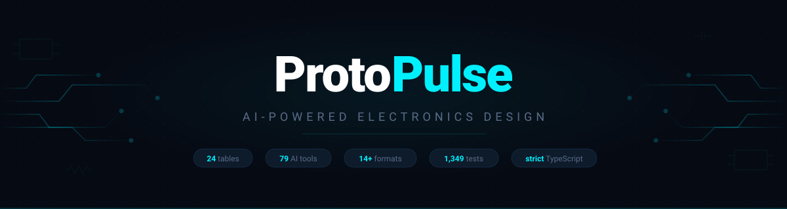
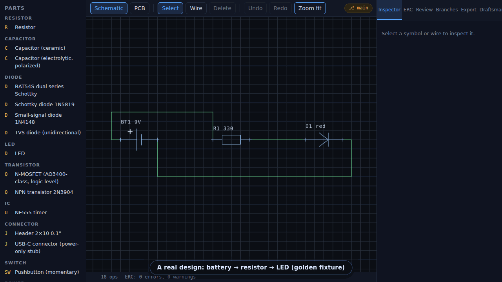
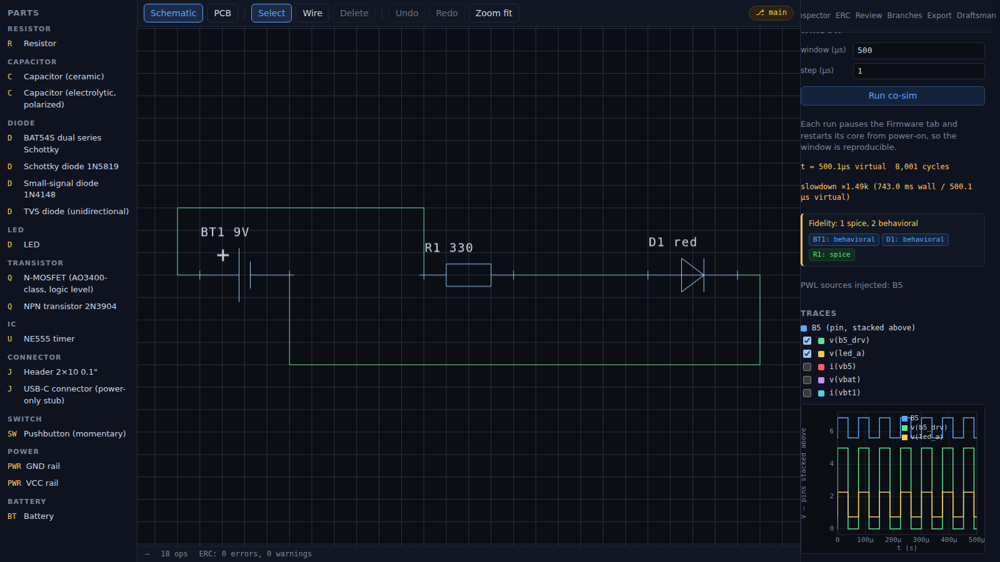
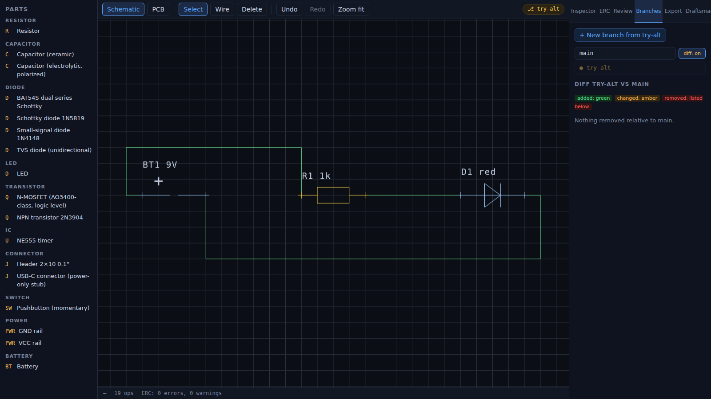
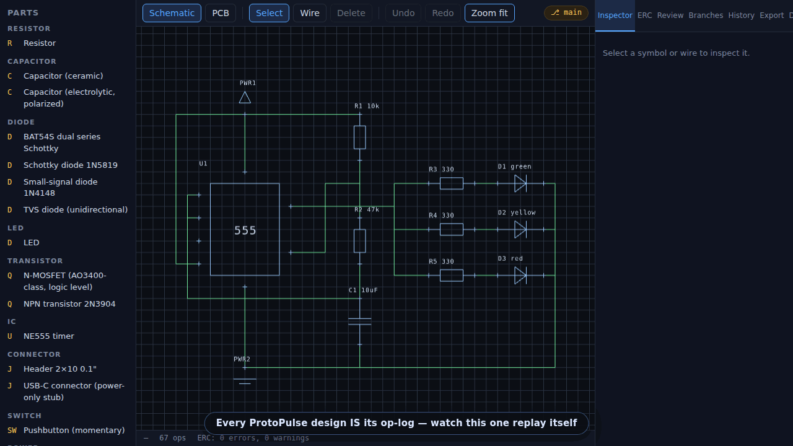
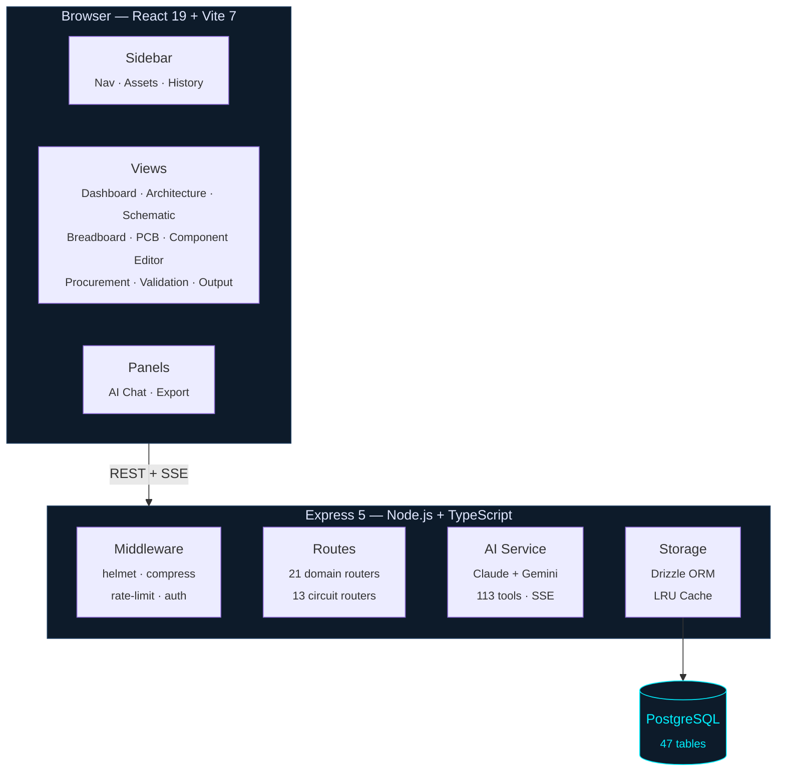

<div align="center">

<br>



<br>
<br>

**The all-in-one electronics design tool for makers who learn by building.**
<br>
*Design · Wire · Simulate · Program · Export — with AI holding your hand the whole way.*

<br>

[](https://www.typescriptlang.org/)
[](https://react.dev/)
[](packages/README.md)
[](LICENSE)

[**Features**](#features) · [**Why ProtoPulse**](#why-protopulse) · [**Quick Start**](#quick-start) · [**The Engine**](#the-engine-packages) · [**AI Engine**](#ai-engine) · [**Architecture**](#architecture) · [**Roadmap**](#roadmap) · [**Docs**](#documentation)

</div>

<br>

---

<br>

## The Pitch

Every electronics learning journey currently requires bouncing between 4-6 different tools — TinkerCad to learn basics, Wokwi to simulate microcontrollers, Fritzing for breadboard layout, KiCad for schematic/PCB, and some SPICE tool for simulation. Each transition is a cliff where people drop off.

**ProtoPulse is what happens when you refuse to use 6 tools and build one that does everything.** Born from a real project — a maker building a rover with Arduino Mega, ESP32, and salvaged hoverboard motors — who couldn't find a single tool that covered the full journey from "I don't know electronics" to "here are my Gerbers."

The AI doesn't just chat — it has **113 tool actions** that place components, wire connections, populate your BOM, run design rule checks, and export manufacturing files. Describe a circuit in plain English. Watch it appear on screen. And in the redesigned engine, a **six-member AI crew** — Draftsman, Analyst, Professor, Router, Architect, Buyer — works the same design graph you do, every action signed and undoable.

> **Think TinkerCad + Fritzing + KiCad, unified in the browser, with an AI engineer sitting next to you who never gets tired of explaining things.**

<br>

<!--
  ┌─────────────────────────────────────────────────────────────┐
  │  TODO: Add product screenshot or GIF here once the app      │
  │  is running with a populated project. Capture the           │
  │  schematic editor with a non-trivial circuit, dark theme,   │
  │  neon cyan accents visible. Use shot-scraper or manually.   │
  │                                                              │
  │               │
  └─────────────────────────────────────────────────────────────┘
-->

## Features

<table>
<tr>
<td width="50%" valign="top">

<h3>Schematic Capture</h3>

Full interactive circuit editor — place component **instances**, draw **nets** with Manhattan routing, add power symbols, no-connect markers, and net labels. **ERC** catches unconnected pins, shorted outputs, and conflicting drivers in real time. Hierarchical sheets for large designs.

</td>
<td width="50%" valign="top">

<h3>AI Design Assistant</h3>

An AI that **acts**, not just answers. Generate complete architectures from a sentence. Place components, wire connections, populate your BOM, run validation, export to KiCad — **113 tool actions** across 11 modules. Streams via SSE with **Claude** and **Gemini** support.

</td>
</tr>
<tr>
<td width="50%" valign="top">

<h3>Architecture Editor</h3>

Interactive block diagram canvas powered by React Flow. Drag components from a categorized library — MCU, Sensor, Power, Communication, Connector, Memory, Actuator — connect them with typed signal edges (SPI, I2C, UART, USB, Power, GPIO), and see your entire system at a glance.

</td>
<td width="50%" valign="top">

<h3>Multi-Format Export</h3>

**14+ output formats** covering the full manufacturing handoff: **KiCad** · **Eagle** · **SPICE** · **BOM CSV** · **Gerber** (copper, mask, silkscreen, paste) · **drill files** (Excellon) · **pick-and-place** · **netlist** · **design report** · **FMEA** · **firmware scaffold** · **PDF**.

</td>
</tr>
<tr>
<td width="50%" valign="top">

<h3>Breadboard & PCB Views</h3>

Breadboard visualization for prototyping layout. PCB layout view with layer management, trace routing, width presets, and ratsnest overlay. Translate your schematic to physical placement without leaving the browser.

</td>
<td width="50%" valign="top">

<h3>Design Validation</h3>

Automated **DRC** catches errors, warnings, and info-level issues across your design. **ERC** validates schematic connectivity. Manufacturer rule templates (JLCPCB, PCBWay, OSHPark). Each finding shows the affected component, a human-readable message, and a suggested fix.

</td>
</tr>
<tr>
<td width="50%" valign="top">

<h3>SPICE Simulation</h3>

Generate SPICE netlists. Run **AC/frequency analysis** with Bode plots — gain and phase across decades. Five filter topologies supported. SI suffix parsing for component values. Simulation results cached per-design.

</td>
<td width="50%" valign="top">

<h3>Bill of Materials</h3>

Full BOM management with pricing, suppliers, stock status, lead times. **BOM snapshot diffing** tracks changes between revisions. **Netlist comparison** (ECO) diffs two circuit versions. Component **lifecycle tracking** flags obsolescence. CSV export.

</td>
</tr>
<tr>
<td width="50%" valign="top">

<h3>Component Editor</h3>

Multi-view part editor: breadboard representation, schematic symbol, PCB footprint, metadata (manufacturer, MPN, package, datasheet), and pin table. Interactive SVG canvas with shape tools. Fork library components and customize.

</td>
<td width="50%" valign="top">

<h3>Dark-First Design</h3>

Crafted dark theme with **neon cyan** (`#00F0FF`) and purple accents, built for long design sessions. Engineering-grade typography: Rajdhani for display, JetBrains Mono for technical data, Inter for body text. Command palette (Ctrl+K) for fast navigation.

</td>
</tr>
</table>

<br>

## Why ProtoPulse

<table>
<tr>
<th align="left">Capability</th>
<th align="center">ProtoPulse</th>
<th align="center">KiCad</th>
<th align="center">Fritzing</th>
<th align="center">EasyEDA</th>
<th align="center">Altium</th>
</tr>
<tr><td><strong>Browser-based</strong></td><td align="center">Yes</td><td align="center">No</td><td align="center">No</td><td align="center">Yes</td><td align="center">No</td></tr>
<tr><td><strong>AI assistant with real tools</strong></td><td align="center"><strong>113 tools + a 6-agent crew</strong></td><td align="center">No</td><td align="center">No</td><td align="center">Limited</td><td align="center">No</td></tr>
<tr><td><strong>Open source</strong></td><td align="center">MIT</td><td align="center">GPL</td><td align="center">GPL</td><td align="center">No</td><td align="center">No</td></tr>
<tr><td><strong>Architecture block diagrams</strong></td><td align="center">Yes</td><td align="center">No</td><td align="center">No</td><td align="center">No</td><td align="center">No</td></tr>
<tr><td><strong>Concept-to-export in one tool</strong></td><td align="center">Yes</td><td align="center">Partial</td><td align="center">No</td><td align="center">Partial</td><td align="center">Yes</td></tr>
<tr><td><strong>BOM snapshot diffing</strong></td><td align="center">Yes</td><td align="center">No</td><td align="center">No</td><td align="center">No</td><td align="center">Plugin</td></tr>
<tr><td><strong>Netlist ECO comparison</strong></td><td align="center">Yes</td><td align="center">Manual</td><td align="center">No</td><td align="center">No</td><td align="center">Yes</td></tr>
<tr><td><strong>14+ export formats</strong></td><td align="center">Yes</td><td align="center">Yes</td><td align="center">Limited</td><td align="center">Partial</td><td align="center">Yes</td></tr>
<tr><td><strong>SPICE simulation</strong></td><td align="center">Yes</td><td align="center">Plugin</td><td align="center">No</td><td align="center">Yes</td><td align="center">Plugin</td></tr>
<tr><td><strong>No installation</strong></td><td align="center">Yes</td><td align="center">No</td><td align="center">No</td><td align="center">Yes</td><td align="center">No</td></tr>
<tr><td><strong>Price</strong></td><td align="center"><strong>Free</strong></td><td align="center">Free</td><td align="center">$8/mo</td><td align="center">Freemium</td><td align="center">$350+/mo</td></tr>
</table>

<br>

## Quick Start

```bash
# Clone and install
git clone https://github.com/wtyler2505/ProtoPulse.git
cd ProtoPulse && npm install

# Push database schema (requires DATABASE_URL in .env)
npm run db:push

# Launch — open http://localhost:5000
npm run dev
```

Seed a demo project with sample data:

```bash
curl -X POST http://localhost:5000/api/seed
```

<details>
<summary><strong>Environment Variables</strong></summary>
<br>

| Variable | Description | Required |
|:---------|:------------|:--------:|
| `DATABASE_URL` | PostgreSQL connection string | Yes |
| `API_KEY_ENCRYPTION_KEY` | 32-byte hex for AES-256-GCM encryption | Production |
| `LOG_LEVEL` | `debug` · `info` · `warn` · `error` | No |
| `NODE_ENV` | `development` · `production` | No |

</details>

<details>
<summary><strong>All Scripts</strong></summary>
<br>

```bash
npm run dev             # Dev server with hot reload (port 5000)
npm run dev:client      # Vite dev server only
npm run build           # Production build (Vite + esbuild)
npm start               # Production server
npm run check           # TypeScript type check (must pass clean)
npm run db:push         # Sync Drizzle schema to PostgreSQL
npm test                # Legacy suite (725 files, ~30.5k tests)
npm run test:packages   # Engine suite (1,534 tests, all green)
npm run test:watch      # Vitest interactive watch mode
npm run test:coverage   # Tests with v8 coverage report
npx eslint .            # Lint (strict TypeScript rules)
npx prettier --write .  # Format
```

</details>

<br>

## The Engine (packages/)

ProtoPulse is being redesigned from the ground up ("the vision", three volumes). The greenfield npm-workspaces monorepo at [`packages/`](packages/README.md) lives *alongside* the legacy app above — which keeps running untouched and migrates onto the engine via a checklist-gated [migration milestone](ROADMAP.md#migration-milestone--legacy-retirement-between-v06-and-v07). **Four engine stages have shipped complete** — v0.1 The Graph, v0.2 The Lab, v0.3 The Crew, v0.4 The Board — with v0.5 The Bridge (firmware emulation) and v0.6 The World (sync, community, manufacturing) most of the way there. [`ROADMAP.md`](ROADMAP.md) is the canonical, dated record.

The thesis: **one canonical design graph, many projections.** Every mutation is a typed operation; the design IS its op-log (JSON Lines), and the graph is just a materialized view. That one decision buys deterministic byte-exact exports, exact undo (inverse ops), O(1) branches, visual diff, three-way merge with conflicts surfaced as data, time-lapse replay, and zero-conflict live sync — all from the same mechanism, never silently resolved.

<p align="center">

</p>
<p align="center"><em>The whole thesis in one ~20 s loop: real AVR firmware → live emulation → pin bound to a net → SPICE-solved response, one axis.</em></p>

<table>
<tr>
<td width="50%"></td>
<td width="50%"></td>
</tr>
<tr>
<td align="center"><em>The new editor — 555 astable with three LED branches (golden fixture)</em></td>
<td align="center"><em>Co-sim: real AVR firmware's square wave over the SPICE-solved response, one axis</em></td>
</tr>
<tr>
<td width="50%"></td>
<td width="50%"></td>
</tr>
<tr>
<td align="center"><em>The board canvas (v0.4) — pads, copper trace, via</em></td>
<td align="center"><em>O(1) branches with the diff overlay — R1's edit on <code>try-alt</code> flagged amber vs <code>main</code></em></td>
</tr>
</table>

<p align="center">

</p>
<p align="center"><em>The design IS its op-log: the History tab replays any design building itself, op by op.</em></p>

> Screenshots are artifacts of [`tools/screenshots/`](tools/screenshots/README.md) — regenerated by script, never hand-cropped.

| Package | What it does |
|:--------|:-------------|
| `@protopulse/graph` | The core — typed ops, integer-nm coordinates, branch/diff/merge, `.ppx` stores. 100% branch coverage gate, enforced in CI. |
| `@protopulse/parts` · `erc` · `export` | 18-part seed library with provenance tiers + community part packs · pin-conflict ERC with executable fixes · byte-exact KiCad netlist, BOM, Gerber X2, Excellon, pick-and-place, panelization |
| `@protopulse/drc` · `route` | DRC against versioned fab decks (JLC / OSHPark / PCBWay) · walkaround + shove-with-spring-back routing, zone pours with thermal reliefs |
| `@protopulse/sim` · `cosim` · `emu` | ngspice-WASM simulation with fidelity tiers, Monte Carlo, FFT · the closed firmware↔analog co-sim loop · ATmega328P, RP2040, and a from-scratch ESP32-S3 Xtensa core (windowed ABI, interrupts, ADC, timers, XIP from real `.bin` app images, plus PCNT/I2C/SPI/MCPWM/TWAI surfaces) running real machine code |
| `@protopulse/cli` | `protopulse check` / `export` / `import-legacy` — headless ERC, "CI for circuits" (exit 0/1/2), the legacy-Postgres migration path |
| `@protopulse/renderer` · `app` | WebGL2 scene graph with SDF text + GPU picking · the editor: schematic + PCB modes, sim panels, branches with merge resolver, replay, live sync, fab exports |
| `@protopulse/ai` · `review` · `relay` | The **six-member crew** (Draftsman · Analyst · Professor · Router · Architect · Buyer) on one runtime with op-log blame · versioned design-review decks · the zero-conflict sync relay |
| `@protopulse/content` | Fab rule decks, review decks, sourcing catalog, the complete 88-article concepts wiki, curriculum Track 1 "First Light" |

**1,534 tests**, own CI (`.github/workflows/packages-ci.yml`): typecheck, lint, tests, golden smoke, builds.

```bash
npm run check:packages           # typecheck every package
npm run test:packages            # all 1,534 engine tests
npm run -w @protopulse/app dev   # new editor → http://localhost:5174
npm run -w @protopulse/cli build && node packages/cli/dist/protopulse.js check <design>
```

**Engine roadmap:** canonical home is [`ROADMAP.md`](./ROADMAP.md) (v0.1 The Graph → v0.7 The Probe, each entry dated); the frozen founding spec lives in [`docs/vision/`](./docs/vision/README.md).

See [`packages/README.md`](packages/README.md) for the full 16-package map, conventions, and format spec pointers.

<br>

## AI Engine

> This section describes the **legacy app's** AI stack (`server/ai.ts`). The redesigned engine has its own provider-agnostic agent runtime, [`@protopulse/ai`](#the-engine-packages), home of the complete six-member crew — new agent work targets that runtime.

The AI doesn't just chat — it has **113 tool actions** that directly manipulate your design:

<table>
<tr>
<th align="left">Module</th>
<th align="left">Actions</th>
</tr>
<tr><td><strong>Architecture</strong></td><td>Add/remove/update nodes and edges · generate complete architectures from text · auto-layout · manage hierarchical sheets · assign net names · set pin maps</td></tr>
<tr><td><strong>Circuit</strong></td><td>Create circuits · place/remove instances · draw/remove nets · place power symbols, no-connects, net labels · run ERC · place breadboard wires · draw PCB traces · auto-route</td></tr>
<tr><td><strong>BOM</strong></td><td>Add/remove/update items · export CSV · pricing lookup · suggest alternatives · optimize BOM · parametric search · add datasheets · compare components</td></tr>
<tr><td><strong>Validation</strong></td><td>Run DRC · add/clear issues · power budget analysis · voltage domain check · auto-fix · DFM check · thermal analysis · generate test plan</td></tr>
<tr><td><strong>Export</strong></td><td>KiCad · Eagle · SPICE · BOM CSV · Gerber · drill · pick-and-place · netlist (KiCad + CSV) · design report · Fritzing project</td></tr>
<tr><td><strong>Component</strong></td><td>Create/modify/delete parts · fork library components · validate</td></tr>
<tr><td><strong>Navigation</strong></td><td>Switch views · switch schematic sheets</td></tr>
<tr><td><strong>Project</strong></td><td>Rename · update description · save decisions · add annotations · undo/redo · analyze images</td></tr>
</table>

Every action is **typed**, **validated**, and **idempotent**. Destructive actions require explicit confirmation.

**Multi-model routing**: Claude handles complex reasoning; Gemini provides an alternative. Both stream over SSE.

<details>
<summary><strong>Example: AI builds a power supply</strong></summary>
<br>

> **You:** "Design a 3.3V regulated power supply from USB-C input with input protection and decoupling."

The AI will:
1. **Add architecture nodes** — USB-C connector, TVS diode, ferrite bead, LDO regulator, decoupling caps
2. **Wire them together** with typed signal edges (Power, Data)
3. **Populate the BOM** — specific part numbers, pricing, package types
4. **Run DRC** — verify power domain consistency, missing decoupling
5. **Generate** a SPICE netlist for simulation

All in a single streamed response. Every action logged and undoable.

</details>

<br>

## Architecture

> Two architectures coexist in this repo. The diagram below is the **legacy app** (`client/` `server/` `shared/`) — still the shipping product. The redesigned engine is the [`packages/`](#the-engine-packages) monorepo, and the legacy app migrates onto it in later milestones.


```mermaid
graph TB
    subgraph Browser["Browser — React 19 + Vite 7"]
        direction LR
        Sidebar["Sidebar<br><sub>Nav · Assets · History</sub>"]
        Views["Views<br><sub>Dashboard · Architecture · Schematic<br>Breadboard · PCB · Component Editor<br>Procurement · Validation · Output</sub>"]
        Panels["Panels<br><sub>AI Chat · Export</sub>"]
    end

    Browser -->|"REST + SSE"| Server

    subgraph Server["Express 5 — Node.js + TypeScript"]
        direction LR
        MW["Middleware<br><sub>helmet · compress<br>rate-limit · auth</sub>"]
        Routes["Routes<br><sub>21 domain routers<br>13 circuit routers</sub>"]
        AI["AI Service<br><sub>Claude + Gemini<br>113 tools · SSE</sub>"]
        Storage["Storage<br><sub>Drizzle ORM<br>LRU Cache</sub>"]
    end

    Storage --> DB[("PostgreSQL<br><sub>47 tables</sub>")]

    style Browser fill:#0D1B2A,stroke:#1B3A5C,color:#E0E7FF
    style Server fill:#0D1B2A,stroke:#1B3A5C,color:#E0E7FF
    style DB fill:#0D1B2A,stroke:#00F0FF,color:#00F0FF
```

<details>
<summary><strong>Tech Stack</strong></summary>
<br>

| Layer | Technology |
|:------|:-----------|
| **Frontend** | React 19 · TypeScript 5.6 · Vite 7 · Tailwind CSS v4 |
| **UI** | shadcn/ui (60+ components) · Radix UI · @xyflow/react |
| **State** | TanStack React Query (no Redux) |
| **Backend** | Node.js · Express 5 · TypeScript (tsx) |
| **Database** | PostgreSQL · Drizzle ORM · LRU cache |
| **AI** | Anthropic Claude SDK · Google Generative AI SDK |
| **Auth** | Session-based (X-Session-Id) · scrypt · AES-256-GCM |
| **Testing** | Vitest 4 · happy-dom · @testing-library/react · v8 coverage |
| **Routing** | Wouter (client) · Express barrel routers (server) |

</details>

<details>
<summary><strong>Database Schema — 47 tables (core selection below)</strong></summary>
<br>

| Table | Purpose |
|:------|:--------|
| `projects` | Top-level project records (soft delete) |
| `architecture_nodes` | Block diagram nodes (soft delete) |
| `architecture_edges` | Block diagram connections (soft delete) |
| `bom_items` | Bill of materials line items (soft delete) |
| `bom_snapshots` | Versioned BOM snapshots for diffing |
| `validation_issues` | DRC/ERC findings |
| `chat_messages` | AI conversation history with branches |
| `history_items` | Design change history |
| `users` | User accounts |
| `sessions` | Auth sessions with rotation |
| `api_keys` | Encrypted user API keys (AES-256-GCM) |
| `user_chat_settings` | Per-user AI chat configuration |
| `component_parts` | User-defined custom component parts |
| `component_library` | Shared component library entries |
| `circuit_designs` | Schematic designs (hierarchical sheets) |
| `hierarchical_ports` | Sheet port declarations |
| `circuit_instances` | Placed component instances |
| `circuit_nets` | Named electrical nets |
| `circuit_wires` | Wire segments |
| `simulation_results` | SPICE simulation output cache |
| `ai_actions` | Audit log of AI-executed actions |
| `design_preferences` | Per-project design rule preferences |
| `spice_models` | User SPICE model library |
| `component_lifecycle` | Component obsolescence tracking |
| `design_snapshots` | Versioned design snapshots for diffing |
| `design_comments` | Spatially-pinned design review comments |

</details>

<details>
<summary><strong>Project Structure</strong></summary>
<br>

```
client/src/
  pages/                Route pages (ProjectWorkspace, AuthPage)
  components/
    views/              Architecture, Schematic, ComponentEditor, Procurement,
                        Validation, Output, BomDiff, Dashboard, WelcomeOverlay
    circuit-editor/     SchematicCanvas, BreadboardView, PCBLayoutView, ERCPanel,
                        NetClassPanel, HierarchicalSheetPanel, NetDrawingTool
    panels/             ChatPanel, ExportPanel, AssetManager
    layout/             Sidebar, WorkflowBreadcrumb, ProjectExplorer
    ui/                 60+ shadcn/ui primitives, CommandPalette
  lib/
    project-context     ProjectProvider — 40+ state values, React Query mutations
    circuit-editor/     Wire router, breadboard model, ERC engine
    simulation/         SPICE generator, circuit solver, frequency analysis
    component-editor/   Constraint solver, diff engine, snap engine

server/
  routes.ts             Barrel — 21 domain routers from server/routes/
  routes/               auth, projects, architecture, bom, validation, chat,
                        history, components, settings, admin, seed, batch,
                        bom-snapshots, chat-branches, design-preferences,
                        spice-models, component-lifecycle, project-io,
                        design-history, comments, backup
  circuit-routes.ts     Barrel — 13 circuit routers from server/circuit-routes/
  circuit-routes/       designs, instances, nets, wires, netlist, exports,
                        simulations, hierarchy, imports, autoroute, expansion
  ai.ts                 AI integration — Claude + Gemini, streaming, 113 tools
  ai-tools/             11 modules: architecture, bom, circuit, component,
                        export, navigation, project, validation, registry, types
  storage.ts            IStorage interface + DatabaseStorage (LRU cache, 1,598 lines)
  export/               16 files — KiCad, Eagle, SPICE, BOM, Gerber, drill,
                        pick-and-place, netlist, design-report, FMEA, firmware,
                        PDF, DRC-gate, FZPZ handler, types

shared/
  schema.ts             27 Drizzle tables + Zod validators
  drc-engine.ts         Design rule checking engine (server + client)
  bom-diff.ts           BOM snapshot comparison engine
  netlist-diff.ts       Netlist comparison / ECO engine
  component-types.ts    Component editor type system
  drc-templates.ts      Manufacturer DRC rule templates
```

</details>

<br>

## Quality

<table>
<tr>
<td align="center"><strong>725</strong><br><sub>legacy test files</sub></td>
<td align="center"><strong>~30.5k</strong><br><sub>legacy tests passing</sub></td>
<td align="center"><strong>1,534</strong><br><sub>engine tests, all green</sub></td>
<td align="center"><strong>0</strong><br><sub>TypeScript errors</sub></td>
<td align="center"><strong>47</strong><br><sub>database tables</sub></td>
<td align="center"><strong>50+</strong><br><sub>API endpoints</sub></td>
</tr>
</table>

- **Vitest 4** with workspace projects (server + client isolation)
- **happy-dom** for client-side component testing
- **@testing-library/react** for behavior-driven UI tests
- **v8 coverage** reporting
- **ESLint** strict TypeScript rules + **Prettier** formatting (covers `packages/` too — zero errors policy)
- **Zod** validation on every API boundary
- The engine adds its own **1,534 tests** (`npm run test:packages`), byte-exact golden-file export tests in `tools/golden/`, and a **100% branch coverage gate** on the graph core — all enforced in a separate, fully green CI workflow
- Honest note: ~421 legacy tests are env-dependent and failing on `main` (tracked in [ROADMAP — off-vision work items](ROADMAP.md#off-vision-work-items)); the engine workflow is the merge gate and stays green

<br>

## Roadmap

Legacy app phases:

```
Phase 2   ████████████████████  Complete    Component Editor (SVG, connectors, buses)
Phase 3   ████████████████████  Complete    Circuit schematic capture (instances, nets, ERC)
Phase 4   ████████████████████  Complete    Breadboard / PCB layout, Gerber & KiCad export
Phase 5   ████████████████████  Complete    Circuit simulation, SPICE, frequency analysis
Phase 0   ██████████████░░░░░░  Active      Audit + feature waves (ledger: docs/MASTER_BACKLOG.md)
Phase 1   ░░░░░░░░░░░░░░░░░░░░  Next        Live simulation, breadboard wiring, hardware comms
```

> Legacy-app phase work is paused in favor of the engine; the engine roadmap below is where the action is.

Engine redesign (the vision, three volumes): **v0.1 The Graph, v0.2 The
Lab, v0.3 The Crew, and v0.4 The Board are complete**; v0.5 The Bridge
and v0.6 The World are most of the way there, the legacy→`.ppx` importer
exists, and what remains is gated on hardware, product decisions, or one
emulator epic. The canonical, dated record is [`ROADMAP.md`](./ROADMAP.md);
the frozen founding spec is [`docs/vision/`](./docs/vision/README.md).

**The Vision:** ProtoPulse aims to be the single tool a maker needs from "I've never touched electronics" to "here are my Gerbers." The engine redesign is how it gets there; see also [`docs/future-features-and-ideas-list.md`](docs/future-features-and-ideas-list.md) for the legacy-app idea backlog including camera-based component ID and engineering calculators.

<br>

## Documentation

| Document | Audience | Covers |
|:---------|:---------|:-------|
| **[ROADMAP.md](ROADMAP.md)** | Everyone | The canonical build order and status — every engine stage, dated, with honest cuts stated |
| **[ARCHITECTURE.md](ARCHITECTURE.md)** | Engineers | Deliberately thin pointer index — one home per fact |
| **[packages/README.md](packages/README.md)** | Engineers | The redesigned engine — 16-package map, conventions, `.ppx` format pointers |
| **[DEVELOPER.md](docs/DEVELOPER.md)** | Engineers | Architecture, API reference (50+ endpoints), database schema, middleware, auth flow |
| **[USER_GUIDE.md](docs/USER_GUIDE.md)** | End users | Feature walkthroughs (legacy app + new editor), keyboard shortcuts, troubleshooting |
| **[AI_AGENT_GUIDE.md](docs/AI_AGENT_GUIDE.md)** | AI assistants | Conventions, file organization, both AI stacks, development rules |
| **[FEATURE_MATURITY.md](docs/FEATURE_MATURITY.md)** | Everyone | The honesty matrix — what's production, what's partial, what's a stub |
| **[CHANGELOG.md](docs/CHANGELOG.md)** | Everyone | Dated history of every landing |
| **[docs/vision/](docs/vision/README.md)** | Everyone | The frozen three-volume founding spec — deviations get ADRs, never edits |

<br>

## Contributing

ProtoPulse follows **vertical slice development** — every feature flows top-to-bottom:

```
Schema  →  Storage  →  API Route  →  React Query  →  UI Component  →  Test
```

Key conventions:

- `data-testid` on all interactive elements
- Zod validation on every request body
- Soft deletes for data retention
- `import type` enforced by ESLint
- ErrorBoundary per view
- `npm run check` must pass with **zero errors**
- `npm test` must pass with **zero failures**

See **[AI_AGENT_GUIDE.md](docs/AI_AGENT_GUIDE.md)** for the complete development rules.

<br>

---

<div align="center">

<br>

*Built with caffeine, curiosity, and way too many datasheets.*

<br>

**MIT License** · [Tyler](https://github.com/wtyler2505)

<br>

</div>
