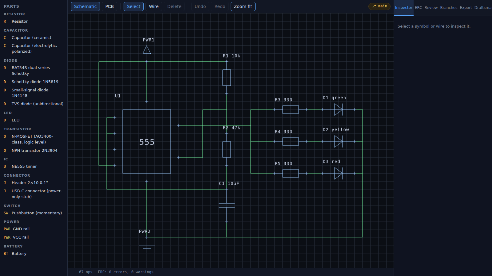
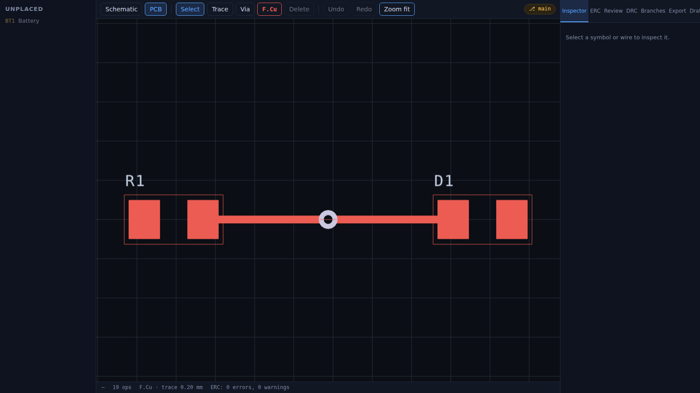

# The ProtoPulse engine (`packages/`)

This is the ground-up redesign described in [the vision](../docs/vision/README.md):
**one canonical design graph, many projections** — schematic, PCB, BOM,
simulation, and firmware co-simulation as views of a single model, with
a git-style operation log underneath. It lives alongside the legacy app
(`client/ server/ shared/`), which keeps running untouched; proven pieces
of the old code are ported in deliberately, and the app migrates onto
this engine via the [migration milestone](../ROADMAP.md#migration-milestone--legacy-retirement-between-v06-and-v07).

The thesis in one sentence: every mutation is a typed operation, **the
design IS its op-log**, and the graph is a materialized view. That one
decision buys deterministic byte-exact exports, exact undo (inverse
ops), O(1) branches, visual diff, three-way merge with conflicts
surfaced as data, time-lapse replay, and zero-conflict live sync — all
from the same mechanism.

<table>
<tr>
<td width="50%"></td>
<td width="50%"></td>
</tr>
<tr>
<td align="center"><em>Schematic canvas — the <code>traffic-light-555</code> golden fixture</em></td>
<td align="center"><em>PCB canvas — <code>routed-led</code>: pads, stroked trace, via</em></td>
</tr>
</table>

Screenshots are artifacts of [`tools/screenshots/`](../tools/screenshots/README.md)
— regenerate the set when a UI change alters these views.

## Packages

Sixteen workspaces, **1,537 tests**, one CI gate. Status per stage lives
in [`ROADMAP.md`](../ROADMAP.md) — never here.

| Package | What it is | Depends on |
|---|---|---|
| `@protopulse/graph` | **The product.** Typed ops (schematic + PCB + buses/sheets/zones/outline), materializer, invariants, branch/diff/merge, value parser, `.ppx` stores | uuid, zod |
| `@protopulse/parts` | Part model + 18-part seed library (ERC pin types, symbol geometry, footprints, provenance tiers) + the `pp-part-pack` community format | graph |
| `@protopulse/erc` | Pin-conflict matrix + net rules; findings carry executable fixes; every code maps to a concept article | graph, parts |
| `@protopulse/export` | Deterministic exports — KiCad netlist, CSV BOM, Gerber X2 (+ Edge.Cuts), Excellon drill, pick-and-place, panelization (V-cut or mouse-bites). Exports are contracts | graph, parts |
| `@protopulse/drc` | Width/clearance/annular/drill/edge/zone checks against versioned fab rule decks (JLC, OSHPark, PCBWay) | graph, parts, content |
| `@protopulse/route` | Interactive routing engine — walkaround, shove with spring-back and cascade, zone pours (martinez clipping, thermal reliefs) | graph, parts |
| `@protopulse/sim` | Graph→SPICE with model fidelity tiers; ngspice-WASM engine; op/tran/dc/ac/noise, Monte Carlo, parameter stepping | graph, parts |
| `@protopulse/emu` | MCU cores under one contract: ATmega328P (avr8js — timers, UART, ADC, SPI, TWI, EEPROM, watchdog), RP2040 (rp2040js), and a from-scratch ESP32-S3 — a full Xtensa LX7 interpreter (code density, windowed ABI, exceptions + level-1 interrupts, the interrupt matrix with GPIO/UART/TIMG/GDMA sources, SAR ADC1/ADC2 + APB_SARADC digital-controller substrate + GDMA ADC continuous frames, TIMG0/TIMG1 timers + watchdogs, startup RTC/eFuse/SYSTEM regs, host ROM traps, dual core, esptool `.bin` app images incl. flash-mapped XIP segments, plus PCNT/I2C/SPI/MCPWM/TWAI surfaces with host-drained TWAI TX/RX/error/state-change events, peer ACK/no-ACK behavior, listen-only suppression, RX FIFO overrun, and ACK bus-error flags) — each with a hand-assembler test rig | avr8js, rp2040js |
| `@protopulse/cosim` | The firmware↔analog loop: GPIO edges as PWL sources one way, solved voltages back through comparators and the ADC the other — with honest slowdown accounting | emu, sim |
| `@protopulse/review` | Design review as an artifact: versioned decks, executable fixes, stored reports with opened/closed deltas | graph, parts, erc |
| `@protopulse/relay` | The sync relay: WebSocket rooms that union op-log envelopes (all branches; optional token auth + JSONL persistence). The relay carries, never owns | graph, ws |
| `@protopulse/renderer` | WebGL2 retained scene graph, SDF glyph atlas (crisp text at every zoom), dual picking (GPU ID buffer + flatbush R-tree), nm→px camera | graph, parts |
| `@protopulse/ai` | Provider-agnostic agent runtime — scoped tool registries, destructive-confirm gating, op-log blame — and the six-member crew: **Draftsman, Analyst, Professor, Router, Architect, Buyer** | graph, erc, parts |
| `@protopulse/cli` | `protopulse check` / `export` / `import-legacy` — CI for circuits (exit 0/1/2) and the legacy-Postgres migration path | erc, export |
| `@protopulse/content` | Schemas + loaders for the content layer: fab rule decks, review decks, sourcing catalogs, the 88-article concepts wiki, curriculum tracks | zod, js-yaml |
| `@protopulse/app` | The editor: schematic + PCB modes, sim/co-sim/firmware panels, branches with merge resolver, time-lapse replay, live sync, fab exports, part packs, the whole crew | everything |

`tools/golden/` holds golden-file tests: known op-logs → known exports,
byte-exact. `content/` holds the content layer (fab decks, review decks,
sourcing catalog, concepts wiki, tracks, puzzles).

CI for circuits comes with the badge to prove it — this one is the
real output of `protopulse check --badge` on the traffic-light-555
golden fixture:


```bash
node packages/cli/dist/protopulse.js check <design> --badge circuit.svg
```

The badge always tells the truth — it goes red with the error count
even while the same run fails your pipeline.

## Conventions

- **Integer nanometers everywhere.** `MM = 1_000_000`; the schematic grid
  is 1.27 mm. Floats break diff determinism; zod rejects them at the
  boundary.
- **Ports are `componentId:pinKey`.** They exist iff their component
  exists — dangling references are unrepresentable.
- **The design IS its op log.** The graph is a materialized view; undo
  emits inverse ops; branches are pointers; merge conflicts surface as
  data and are never resolved silently.
- **Honest cuts are stated, not hidden.** Every shipped slice names what
  it deliberately does not do — in the module header, the ROADMAP entry,
  and the CHANGELOG. A doc that overstates is treated as a bug.
- **Hardware facts are verified, never invented.** Seed parts, fab deck
  capabilities, and sourcing numbers are checked against datasheets and
  official capability pages, with sources filed to `inbox/`.
- **Packages ship TypeScript source** (`main: ./src/index.ts`). Vite,
  Vitest, and tsx consume it directly; only the CLI builds a bundle.

## Working on it

```bash
npm run check:packages           # typecheck every package (one program)
npm run test:packages            # all 1,537 engine tests
npm run -w @protopulse/app dev   # editor on http://localhost:5174
npm run -w @protopulse/relay dev # sync relay (optional, for live collaboration)
npm run -w @protopulse/cli build && node packages/cli/dist/protopulse.js check <design>
```

CI: `.github/workflows/packages-ci.yml` (path-filtered; the legacy
`ci.yml` is independent). The graph package enforces its own coverage
gate — 100% branch on ops/apply/materialize/diff.

## Format spec

The `.ppx` on-disk format — identity, ordering, invariants,
branch/diff/merge semantics — is specified in
[`graph/README.md`](./graph/README.md). The data outlives the tool.
